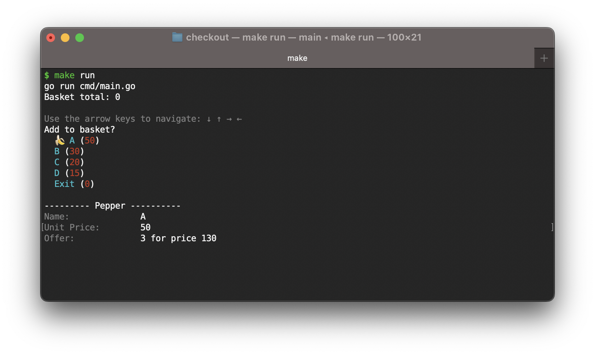
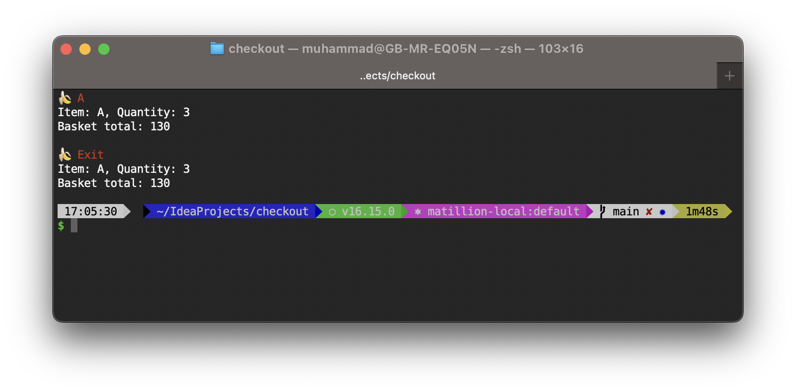

## Checkout

**Note:**

I have added the CLI to visualise the checkout system. If it creates issue on your side, then I would suggest you to
checkout stable version of app tagged as [v1.0.0](https://github.com/muhammad-raza/checkout/tree/v1.0.0), so that you get code without CLI.

```shell
git checkout tags/v1.0.0 
```

### Improvements

- Currently, the inventory data is in `inventory.go` which can be moved to database
- Item only supports one offer i.e. `3 for 130`. There is room to improve it and add more offer types e.g. `Meal Deal`
  or `3 for the price of 2` e.t.c
- Unit price is detached from offer price. e.g. if the unit price is changed, the offer can become invalid. This can be
  linked by introducing percentage reduction in price.
- To avoid calculating total price again and again. we can add `totalPrice` and a `priceChanged` attributes
  to `Checkout` struct. We can then return `totalPrice` unless `priceChanged` is true. If `priceChanged` is true, then
  calculate price again. `priceChanged` flag can be set in `Scan` function.
- The CLI added for visualisation has limitations. Currently, it's limited to 4 items only. A fixed element slice is
  used to keep the order of available items.

### Running locally

Tests are sufficient to validate code. I have implemented third party
library [promptui](https://pkg.go.dev/github.com/manifoldco/promptui) to visualise the application.
To run CLI locally, run following command in root of project

```shell
make run
```

After that you will see options on your screen


After each selection, you will see total items in the basket as well as total price as below



### Running test

To run tests, use following command in root of project

```shell
make tests
```

### Finally

Finally, I would like to thank [thinkmoney](https://www.thinkmoney.co.uk/) to give me an opportunity to do this task as
part of interview. I thoroughly enjoyed it as it is closer to real life problem than leetcode style. 
